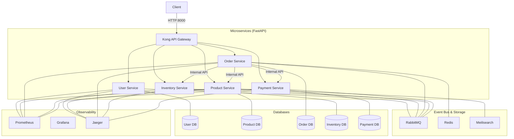
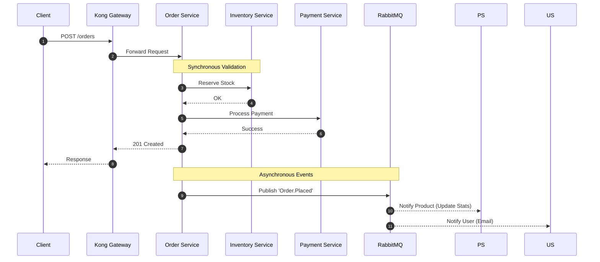
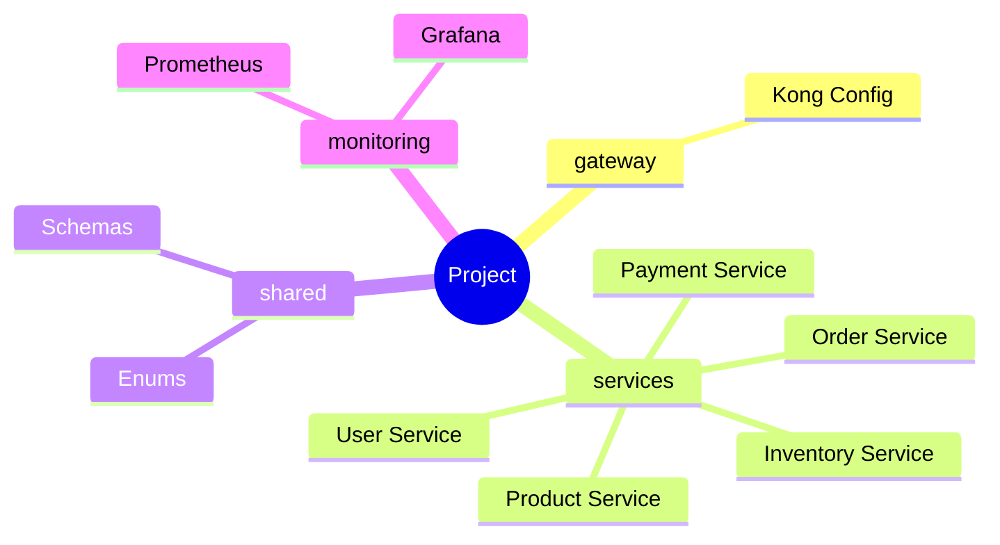

# Microservice Ecosystem


A modular microservice architecture built with FastAPI, Kong Gateway, and RabbitMQ.

## 🏗️ System Architecture



## 🚀 Order Workflow



## 📂 Project Structure



## 🛠️ Tech Stack

| Category | Technology |
| :--- | :--- |
| **Framework** | FastAPI (Python 3.11+) |
| **Gateway** | Kong (DB-less) |
| **Message Broker** | RabbitMQ |
| **Caching** | Redis |
| **Search Engine** | Meilisearch |
| **Database** | PostgreSQL (Per-service) |
| **Tracing** | Jaeger (OpenTelemetry) |
| **Monitoring** | Prometheus & Grafana |

## 🏁 Quick Start

```bash
# 1. Setup environment
cp .env.example .env

# 2. Spin up the cluster
docker-compose up -d --build

# 3. Access Services
# - Gateway: http://localhost:8000
# - Grafana: http://localhost:3001
# - Jaeger: http://localhost:16686
# - Prometheus: http://localhost:9090
```

## 💻 Development

### Setup

Install development dependencies:

```bash
make install-dev
```

### Type Checking

Run static type checking with `mypy`:

```bash
make type-check
```

### Linting

Run linting with `ruff`:

```bash
make lint
```

### Formatting

Format code with `ruff`:

```bash
make format
```
